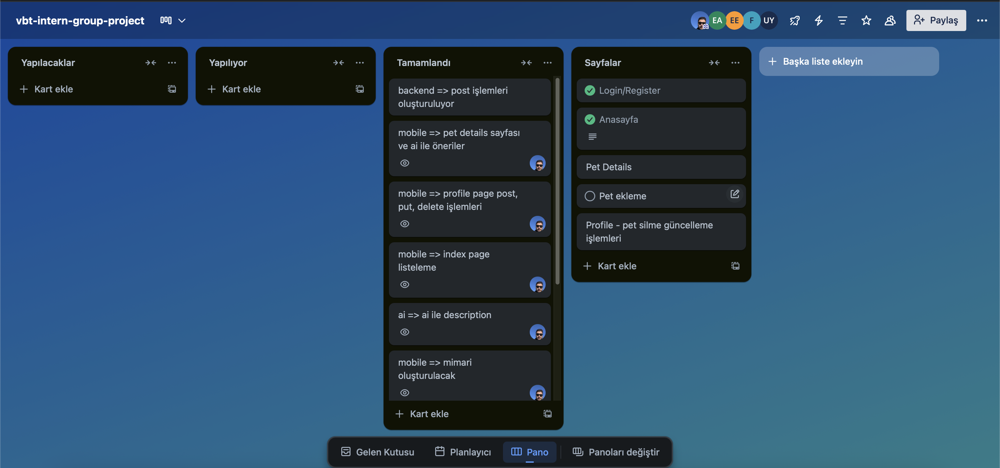

# Proje - Pet Store

Bu proje, hayvan sahiplendirmek için oluşturulmuş bir topluluk platformudur.

## Kullanılan Teknolojiler
* Back-end: .Net Core Web Api, Sql Server
* Front-end: Next.j
* Mobile: Flutter
* Ai: Flask, Gemini

## Kurulum ve Çalıştırma

1. Front-end => https://vbt-petshop.vercel.app
2. Back-end => https://petstoreapi.justkey.online/swagger/index.html
3. Ai => https://unuvarx.pythonanywhere.com/
4. Flutter => Gerekli bilgiler source/pet_store/mobile/README.md dosyasında mevcuttur.

## Ekran Görüntüleri

